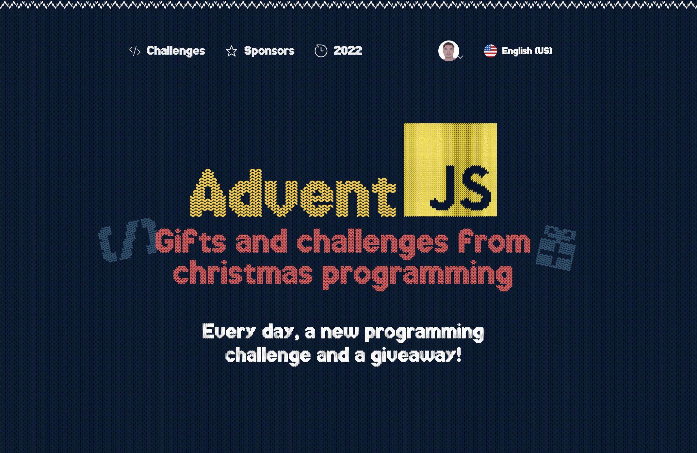

## AdventJS Challenges



##  <strong> [adventJS](https://adventjs.dev/es) is a [@midudev](https://midu.dev/) initiative </strong>

## Challenges

| Day | Title                                                         | Solution                   | Level   | Points |
| --- | ------------------------------------------------------------- | -------------------------- | ------- | ------ |
| #01 | [First gift repeated!](./day01/README.md)                     | [result](./day01/index.js) | Easy    | 150    |
| #02 | [We start the factory](./day02/README.md)                     | [result](./day02/index.js) | Easy    | 270    |
| #03 | [The naughty elf](./day03/README.md)                          | [result](./day03/index.js) | Easy    | 330    |
| #04 | [Turn the parentheses around](./day04/README.md)              | [result](./day04/index.js) | Medium  | 250    |
| #05 | [Santa's CyberTruck](./day05/README.md)                       | [result](./day05/index.js) | Medium  | 150    |
| #06 | [The reindeer on trial](./day06/README.md)                    | [result](./day06/index.js) | Easy    | 270    |
| #07 | [The 3D Boxes](./day07/README.md)                             | [result](./day07/index.js) | Easy    | 190    |
| #08 | [Sorting the warehouse](./day08/README.md)                    | [result](./day08/index.js) | Medium  | 210    |
| #09 | [Switch the lights](./day09/README.md)                        | [result](./day09/index.js) | Easy    | 190    |
| #10 | [Create your own Christmas tree](./day10/README.md)           | [result](./day10/index.js) | Easy    | 160    |
| #11 | [The studious elves](./day11/README.md)                       | [result](./day11/index.js) | Medium  | 40     |
| #12 | [It is a valid copy](./day12/README.md)                       | [result](./day12/index.js) | Medium  | 25     |
| #13 | [Calculating the time](./day13/README.md)                     | [result](./day13/index.js) | Easy    | 80     |
| #14 | [Avoid the alarm](./day14/README.md)                          | [result](./day14/index.js) | Medium  | --     |
| #15 | [](./day15/README.md)| [result](./day15/day15.js) |         |        |
| #16 | [](./day16/README.md)| [result](./day16/index.js) |         |        |
| #17 | [](./day17/README.md)| [result](./day17/index.js) |         |        |
| #18 | [](./day18/README.md)| [result](./day18/index.js) |         |        |
| #19 | [](./day19/README.md)| [result](./day19/index.js) |         |        |
| #20 | [](./day20/README.md)| [result](./day20/day20.js) |         |        |
| #21 | [](./day21/README.md)| [result](./day21/index.js) |         |        |
| #22 | [](./day22/README.md)| [result](./day22/index.js) |         |        |
| #23 | [](./day23/README.md)| [result](./day23/day23.js) |         |        |
| #24 | [](./day24/README.md)| [result](./day24/index.js) |         |        |
| #25 | [](./day25/README.md)| [result](./day25/index.js) |         |        |

## Tests

In order to execute Unit Test, first of all you need to install Jest dependency by running:

```
npm install
```

And then, you can run test by typing:

```
  npm run test
```
